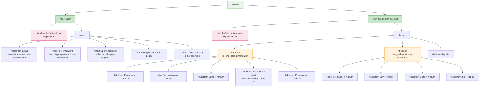
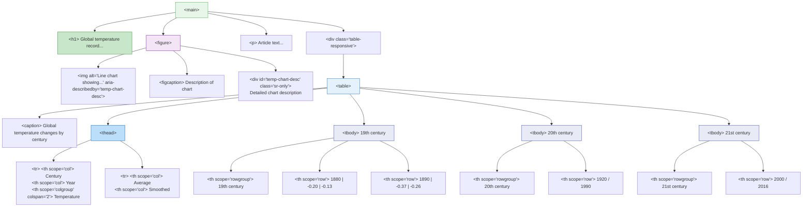
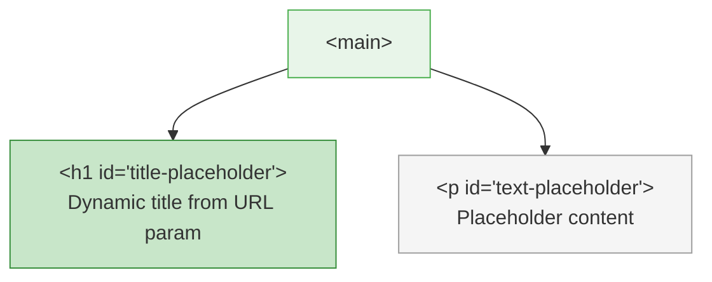

# Web and Mobile Accessibility — Course Project

> **University of Zurich** | Web and Mobile Accessibility | Prof. Dr. Alireza Darvishy
>
> A sample university website with intentional accessibility barriers, systematically fixed to meet **WCAG 2.1 AA** standards across 4 HTML pages.

---

## Exercises

### Exercise 1: Site Exploration

> **Task:** Interact with all 4 pages using keyboard-only navigation and a screen reader (JAWS). Identify features that don't work without a mouse, features that appear functional but are inaccessible, and test all pages with CSS disabled to evaluate content structure and reading order.

We navigated every page using only the Tab key and JAWS, documenting each barrier we encountered. The site had no landmark regions, so JAWS couldn't jump between sections. The heading hierarchy was broken or missing entirely. Form fields on the login page had no associated labels — JAWS just announced "edit" with no context. Images lacked alt text, and the data table on the article page was built entirely with `<td>` cells, making it impossible for a screen reader to convey the row/column relationships. With CSS disabled, the reading order was mostly logical, but the lack of semantic HTML meant the browser's default rendering offered no structural cues. This exploration gave us the full picture of what needed fixing in exercises 2-6.

### Exercise 2: Accessible Design

> **Task:** Add HTML5 landmark regions to all pages. Implement a "Skip to main content" link as the first focusable element. Add accessible font-size controls (A+/A-) with ARIA labels. Fix all color contrast failures to meet WCAG 2.1 AA (4.5:1 minimum).

We replaced the generic `<div>` wrappers on all 4 pages with semantic HTML5 landmarks: `<header>`, `<nav>`, `<main>`, and `<footer>`. This immediately allowed JAWS users to press **R** to jump between page regions. We added a "Skip to main content" link as the very first element in the DOM — it's visually hidden until it receives keyboard focus, at which point it slides into view so sighted keyboard users can see it too. The font-size buttons received `aria-label` attributes (`"Increase font size"`, `"Decrease font size"`) so screen readers announce their purpose instead of just "A+" and "A-". The most impactful fix was contrast: the original site used `#dfdfdf` text on white backgrounds — a catastrophic ~1.4:1 ratio. We overrode this to `#212529`, achieving a 16:1+ contrast ratio that far exceeds the 4.5:1 AA minimum. We also added `lang="en"` to every `<html>` element so screen readers select the correct speech synthesizer.

### Exercise 3: Accessible Navigation

> **Task:** Establish proper heading hierarchy (h1-h6) on all pages. Convert news items to semantic `<article>` elements. Restructure navigation from generic divs to `<ul>`/`<li>` with the full ARIA APG menubar pattern. Convert dropdown toggles from `<a href="#">` to `<button>`. Implement keyboard support: Space to toggle, Escape to close, Tab-out to auto-close. Add `aria-expanded`, `aria-haspopup`, and `aria-controls` on all dropdown toggles.

We established a clear heading hierarchy across all pages: a single `<h1>` per page (visually hidden on the homepage, visible on others), `<h2>` for major sections, and `<h3>` for article titles. This lets JAWS users press **H** to jump between headings and immediately understand the page structure. The three news items on the homepage became `<article>` elements with `aria-label` attributes so each is announced as a distinct content region.

The navigation was the most complex fix. We converted the flat `<div>`-based menu into semantic `<ul>`/`<li>` lists and applied the full ARIA APG menubar pattern: `role="menubar"` on the top-level list, `role="menu"` on dropdown submenus, `role="menuitem"` on every link, and `role="none"` on `<li>` wrapper elements to prevent them from being announced. Dropdown toggles were changed from `<a href="#">` (which are semantically links) to `<button>` elements (which correctly signal an action trigger). Each toggle carries `aria-haspopup="true"`, `aria-expanded="false|true"`, and `aria-controls` pointing to its submenu.

We then wrote a dedicated `nav-keyboard.js` module with three keyboard handlers: **Space** opens/closes a dropdown (matching the APG spec), **Escape** closes the open dropdown and returns focus to the toggle button that opened it, and **Tab-out** detection auto-closes any open dropdown when focus leaves the menu. JAWS now announces the full menu structure including item counts (e.g., "Faculties submenu, 5 items").

### Exercise 4: Accessible Forms

> **Task:** Associate all form fields with `<label>` elements using `for`/`id` pairing. Group related fields with `<fieldset>` and `<legend>`. Add ARIA live region error announcements with `role="alert"`. Write field-specific error messages. Implement focus management on validation failure. Add real-time error clearing as users correct fields.

Every `<p>` tag that was serving as a visual label got converted to a proper `<label>` element with a `for` attribute matching its input's `id`. This affects 12 fields across the login and registration forms — JAWS now announces "Email, edit" instead of just "edit" when a user tabs into a field. The registration form's fields were grouped into two `<fieldset>` blocks with `<legend>` elements: "Basic information (optional)" and "Additional information (optional)", giving screen reader users context about which section they're in.

For error handling, we placed `role="alert"` with `aria-atomic="true"` on the error banner containers. When form validation fails, the error summary is injected into this live region and JAWS announces it immediately without the user needing to search for it. Each field also has an `aria-describedby` attribute pointing to its individual error message element, so when a user tabs to an invalid field, JAWS reads both the label and the specific error. Focus automatically moves to the first invalid field after a failed submission. The same pattern was applied to the forgot-password form for consistency.

### Exercise 5: Accessible Images

> **Task:** Add meaningful alt text to all informative images describing their content. Mark decorative images with `alt=""` so screen readers skip them. For the complex temperature chart, create an accessible description using `<figure>`/`<figcaption>` and a hidden detailed description linked via `aria-describedby`.

The three news article thumbnails on the homepage received descriptive alt text: `"Iceberg in ocean water"`, `"Starfield in deep space"`, and `"Industrial robots on assembly line"` — concise descriptions that convey the image content without being redundant with the surrounding text. The logo image in the header and the mobile navbar logo were marked with `alt=""` since they're purely decorative (the site name is already in text next to them), so JAWS skips them entirely.

The temperature chart on the article page required a layered approach. We wrapped it in a `<figure>` element with a visible `<figcaption>` that describes the chart's general content. We then added a hidden `<div>` with `class="sr-only"` containing a detailed narrative description of the visual trend — explaining that temperatures remained stable until ~1980 and then rose sharply to ~1 degree Celsius above baseline by 2016. The image's `aria-describedby` attribute points to this hidden description, so screen reader users hear both the brief alt text and the full trend description.

### Exercise 6: Accessible Tables

> **Task:** Convert all table header cells from `<td>` to `<th>` with appropriate `scope` attributes (`col`, `row`, `colgroup`, `rowgroup`). Add a `<caption>` element. Move header rows into `<thead>`. Maintain separate `<tbody>` elements for logical row grouping.

The temperature data table on the article page was rebuilt with full semantic markup. All column headers ("Century", "Year", "Average", "Smoothed") became `<th scope="col">` elements, and the "Temperature" header that spans both "Average" and "Smoothed" received `scope="colgroup"` with `colspan="2"`. Year values within each century group use `<th scope="row">`, and the century labels ("19th century", "20th century", "21st century") that span multiple data rows use `<th scope="rowgroup">` with `rowspan`.

The header rows were moved from `<tbody>` into a proper `<thead>` element. Each century's data rows live in their own `<tbody>` to preserve the logical grouping. A `<caption>` element ("Global temperature changes by century") was added as the first child of the table. Since Bootstrap defaults `caption-side` to `bottom`, we added a CSS override to `top` so screen readers announce the table's purpose before users start navigating cells. The result: JAWS now announces full context like *"19th century, 1880, Column: Average, minus 0.20"* instead of just *"minus 0.20"*.

### Exercise 7: Accessibility Testing

> **Task:** Run WAVE on all 4 pages and fix any errors. Test all pages with CSS disabled to verify content readability and source order. Perform a full JAWS walkthrough testing landmarks, headings, links, forms, tables, and keyboard navigation. Document and resolve all discovered issues.

We ran the WAVE Chrome extension on all 4 pages — each returned **zero errors and zero contrast errors**. WAVE alerts were reviewed individually; all were confirmed as intentional patterns (e.g., redundant links in the navigation that serve both desktop and mobile layouts).

With CSS disabled via Chrome DevTools, all content remained readable in the browser's default styling. The source order matched the visual reading order on every page, and semantic structure (headings, lists, fieldsets, table headers) was clearly visible without any styling.

The JAWS walkthrough covered every accessibility feature across all pages: landmark navigation with **R**, heading navigation with **H**, skip-link activation, dropdown menu keyboard operation (Space/Escape/Tab), form label announcements, live-region error messages, image alt text, and table cell-by-cell navigation with scope announcements. Every feature worked as expected.

Final result: **85/85 test checklist items passed** across all 4 pages, with zero issues requiring resolution.

---

## Accessibility Structure (per page)

All four pages share the same landmark skeleton (skip-link, header, nav, main, footer). The diagrams below show the unique semantic content within each page's `<main>` region.

### Shared Landmark Skeleton

```mermaid
graph TD
    A["&lt;html lang='en'&gt;"] --> B["&lt;a&gt; Skip to main content"]
    A --> C["&lt;header&gt;"]
    A --> D["&lt;nav aria-label='Main navigation'&gt;"]
    A --> E["&lt;main id='main' tabindex='-1'&gt;"]
    A --> F["&lt;footer&gt;"]
    A --> G["&lt;div aria-live='polite'&gt; Live Region"]

    C --> C1["img alt='' &#40;decorative logo&#41;"]
    C --> C2["button aria-label='Increase font size'"]
    C --> C3["button aria-label='Decrease font size'"]

    D --> D1["ul role='menubar'"]
    D1 --> D2["li &gt; a role='menuitem' Homepage"]
    D1 --> D3["li &gt; button aria-haspopup Faculties"]
    D3 --> D3a["ul role='menu' &#40;5 items&#41;"]
    D1 --> D4["li &gt; button aria-haspopup Education"]
    D4 --> D4a["ul role='menu' &#40;4 items&#41;"]
    D1 --> D5["li &gt; button aria-haspopup Industry"]
    D5 --> D5a["ul role='menu' &#40;3 items&#41;"]
    D1 --> D6["li &gt; a role='menuitem' Login"]

    F --> F1["a About"]
    F --> F2["a Contact us"]
    F --> F3["a Help"]
    F --> F4["a Terms of service"]
    F --> F5["a Privacy policy"]

    style A fill:#e8f4fd,stroke:#2196F3
    style C fill:#fff3e0,stroke:#FF9800
    style D fill:#fff3e0,stroke:#FF9800
    style E fill:#e8f5e9,stroke:#4CAF50
    style F fill:#fff3e0,stroke:#FF9800
    style G fill:#fce4ec,stroke:#E91E63
```



### index.html — Homepage

```mermaid
graph TD
    M["&lt;main&gt;"] --> H1["&lt;h1 class='sr-only'&gt; Homepage"]
    M --> S1["&lt;h2&gt; News &amp; events"]
    M --> S2["&lt;h2&gt; Studies"]
    M --> S3["&lt;h2&gt; Researches"]

    S1 --> A1["&lt;article aria-label='...'&gt;"]
    A1 --> A1img["img alt='Iceberg in ocean water'"]
    A1 --> A1h["&lt;h3&gt; &lt;a&gt; Global temperature record"]
    A1 --> A1t["&lt;time datetime='2018-01-15'&gt;"]

    S1 --> A2["&lt;article aria-label='...'&gt;"]
    A2 --> A2img["img alt='Starfield in deep space'"]
    A2 --> A2h["&lt;h3&gt; &lt;a&gt; At iam decimum..."]

    S1 --> A3["&lt;article aria-label='...'&gt;"]
    A3 --> A3img["img alt='Industrial robots...'"]
    A3 --> A3h["&lt;h3&gt; &lt;a&gt; Quo plebiscito..."]

    S2 --> S2a["&lt;a&gt; Bachelor programmes"]
    S2 --> S2b["&lt;a&gt; Master programmes"]
    S2 --> S2c["&lt;a&gt; Continuing education"]

    S3 --> S3a["&lt;a&gt; Doctoral programmes"]
    S3 --> S3b["Latest publications &#40;5 links&#41;"]

    style M fill:#e8f5e9,stroke:#4CAF50
    style H1 fill:#c8e6c9,stroke:#388E3C
    style S1 fill:#e3f2fd,stroke:#1976D2
    style S2 fill:#e3f2fd,stroke:#1976D2
    style S3 fill:#e3f2fd,stroke:#1976D2
    style A1 fill:#f3e5f5,stroke:#7B1FA2
    style A2 fill:#f3e5f5,stroke:#7B1FA2
    style A3 fill:#f3e5f5,stroke:#7B1FA2
```



### login.html — Forms



### article.html — Article with Data Table



### empty.html — Placeholder Page



---

## Project Structure

```
web_and_mobile_accessibility/
├── src/
│   ├── index.html                 Landing page (news, education info)
│   ├── login.html                 Login, registration, password reset
│   ├── article.html               Article detail with data table
│   ├── empty.html                 Placeholder page (dynamic title)
│   ├── css/
│   │   ├── common.css             Shared styles, contrast fixes, skip link
│   │   ├── bootstrap.css          Bootstrap 4.0.0 (third-party)
│   │   └── *.css                  Page-specific styles
│   ├── js/
│   │   ├── common.js              Navigation menu, dropdown handling
│   │   ├── nav-keyboard.js        Keyboard support (Space/ESC/Tab)
│   │   ├── login.js               Form validation with ARIA live regions
│   │   ├── bootstrap.js           Bootstrap 4.0.0 (third-party)
│   │   ├── jquery.js              jQuery 3.2.1 (third-party)
│   │   └── popper.js              Popper.js (third-party)
│   └── img/                       Image assets
└── .planning/                     Planning artifacts and phase history
```

---

## Tech Stack

| Layer | Technology |
|-------|-----------|
| Markup | HTML5 with semantic elements and ARIA |
| Styles | CSS3 + Bootstrap 4.0.0 |
| Scripts | Vanilla JavaScript (ES5) + jQuery 3.2.1 |
| Testing | WAVE extension, JAWS, Chrome DevTools |
| Server | Python `http.server` (local dev) |

No frameworks, no build tools, no npm — static files only.

---

## Running Locally

```bash
# Start a local server
cd src
python -m http.server 8000

# Open in browser
# http://localhost:8000
```

---


## Key Design Decisions

| Decision | Why |
|----------|-----|
| Fix in-place, don't rewrite | Course expects incremental improvement to the provided sample |
| ARIA APG menubar pattern | Proper screen reader semantics for dropdown navigation |
| `role="alert"` without explicit `aria-live` | Avoids double-announcement of error messages |
| `scope="rowgroup"` for century cells | Correct semantics for merged row headers in data table |
| `caption-side: top` CSS override | Bootstrap defaults to bottom — top placement improves discoverability |
| Separate code phases from manual testing | Exercises require human browser/screen reader verification |

---

## Lessons Learned

1. **Semantic HTML gives you 80% of accessibility for free** — the highest-impact fixes were simple element swaps (`<div>` to `<header>`, `<p>` to `<label>`, `<td>` to `<th>`)
2. **ARIA supplements, never replaces** — native `<label for="">` always beats `aria-label` on an input
3. **Real screen reader testing catches what automation misses** — JAWS mode switching, announcement order, and focus management can't be tested with WAVE alone
4. **Keyboard operability and screen reader usability are different things** — a site can be fully keyboard-operable but still unusable without semantic structure

---
